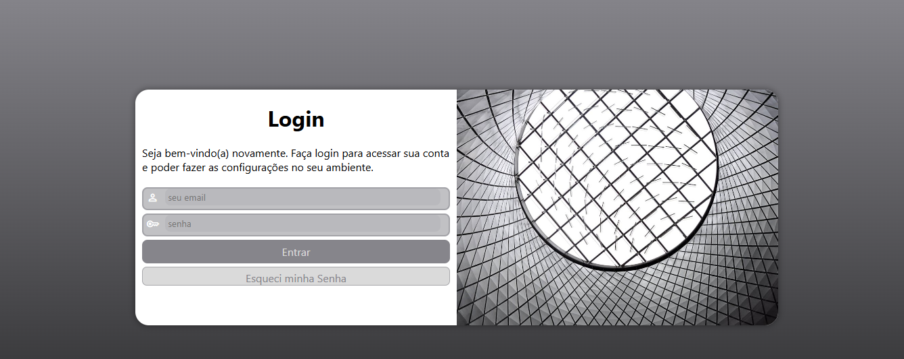

## 📸 Preview do projeto

🔐 Projeto Login
📖 Sobre o projeto

Este projeto consiste em uma interface de tela de login desenvolvida com HTML e CSS, criada durante meus estudos de desenvolvimento web.

O objetivo foi praticar a criação de formulários, estilização de layouts e responsividade, construindo uma página visualmente organizada e moderna para autenticação de usuários.

Projetos como esse são comuns nos estudos iniciais de front-end para aprender estrutura de formulários, layout e estilização com CSS.

🎯 Objetivo

Praticar conceitos fundamentais do desenvolvimento web, como:

Estruturação de páginas com HTML5

Estilização com CSS3

Criação de formulários de login

Organização visual de elementos

Layout responsivo

🛠 Tecnologias utilizadas

HTML5

CSS3

Git

GitHub

GitHub Pages

🌐 Acesse o projeto

🔗 https://patyfc24.github.io/Projeto-login/

📚 Aprendizados

Durante o desenvolvimento deste projeto, pratiquei:

Estrutura de formulários em HTML

Estilização de campos de login

Organização de layout com CSS

Publicação de projetos utilizando GitHub Pages, que permite hospedar sites diretamente de um repositório do GitHub.

👩‍💻 Autora

Projeto desenvolvido por Patricia Felicio durante meus estudos de desenvolvimento web.
